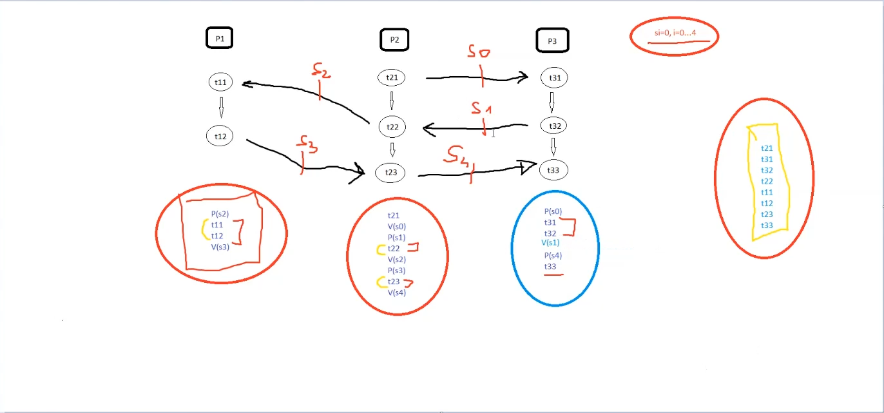

# SO-Zadanie-PK
The exercise from subject "Systemy Operacyjne" from Information Technologies studies 

## Zadanie

1. Utworzyć zbiór semaforów;
2. Ustawić wartości początkowe semaforów;
3. Utworzyć procesy potomne P1, P2, P3;
4. Czeka na zakończenie procesów potomnych;
5. Usunąć zbiór semaforów.

Kolejność wykonywania procesów:

